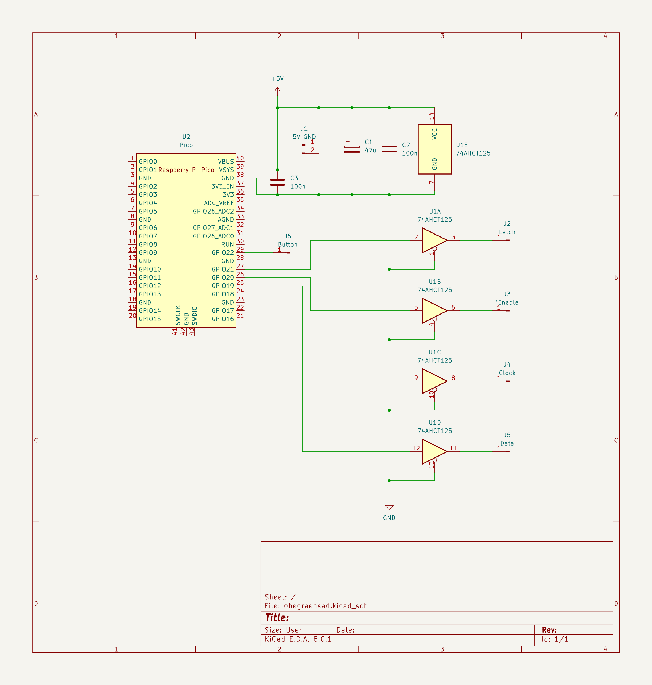

# Rusty OBEGRÄNSAD
Display custom animations on IKEA's OBEGRÄNSAD using Rust on the Raspberry Pi Pico.

## Interfacing with OBEGRÄNSAD
OBEGRÄNSAD consists of 16 daisy-chained SCT2024 16 bit serial-in/parallel-out constant-current LED drivers.
After de-soldering the on-board microcontroller, the Raspberry Pi Pico can be connected to the Clock, Data In, Latch, and inverted Enable inputs of the SCT2024 chain.
These inputs as well as +5V and GND can readily be accessed at the bottom of the OBEGRÄNSAD PCB that contained the original microcontroller.
In order to interface with the 5V CMOS inputs of the SCT2024, a level shifter is required to translate the 3.3V outputs of the Pico to 5V.
I assembled a helper board for level shifting using an SN74AHCT125, wired up as shown in the following schematic:


The timings for the SCT2024 are such that the Clock and Data In lines can be driven by SPI.
To latch the transmitted data to the LEDs, a short positive pulse on the Latch line is required.

Note that the 16 LEDs driven by one SCT2024 are laid out in a circular pattern around each chip such that it is non-trivial to index the LEDs of the display.
While one can derive an algorithm to compute the index of an LED, I found the algorithm not very readable and only used it to compute a look-up table to index the LEDs/pixels.

## Implementing custom animations
A custom animation for the display should implement the `animation::Animation` trait with its only method `render_frame`.
The return value of the `render_frame` method indicates for how long this frame should be displayed.
When implementing this method, you typically want to use `display.clear()` to erase the current contents of the display and then draw your frame using `display.set_pixel()`.

As of now, you then have to manually incorporate your animation into the main rendering loop in `main.rs` (e.g., by replacing `animation_leaves`).
In the future, one could implement to use the button of the display to cycle through different animations.
References to the different animation objects could be held in an array using dynamic dispatching.

## Generating a UF2 binary
Ensure that Rust is up-to-date, target support for `thumbv6m-none-eabi` is provided, and elf2uf2-rs is installed:
```
rustup self update
rustup update stable
rustup target add thumbv6m-none-eabi
cargo install elf2uf2-rs
```

Execute `cargo run --release` to generate the UF2 binary at `target/thumbv6m-none-eabi/release/rusty-obegraensad.uf2`.

## git setup

### GitHub noreply email
```
git config user.name "a-johanson"
git config user.email "a-johanson@users.noreply.github.com"
```

### GitHub tokens
```
git remote add origin https://a-johanson:<TOKEN>@github.com/a-johanson/rusty-obegraensad.git
git push -u origin master
```
