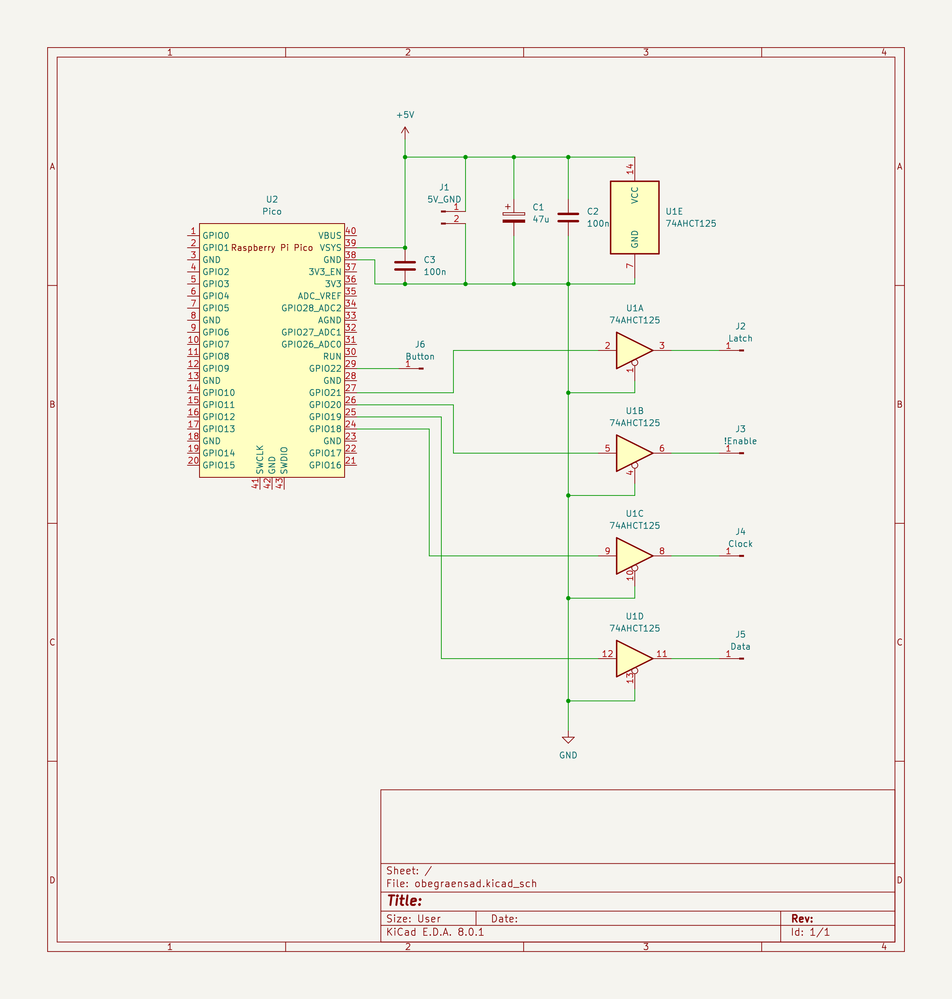

# Rusty OBEGRÄNSAD
Display custom animations on IKEA's OBEGRÄNSAD using Rust on the Raspberry Pi Pico.

## Crates
This repository is split into a Cargo workspace with separate portable and board-specific crates:

- `core`: `no_std` display buffer, OBEGRÄNSAD pixel mapping, animation trait, built-in animations, and hardware boundary traits.
- `boards/pico`: Raspberry Pi Pico firmware. This crate owns RP2040 startup, GPIO, SPI, DMA, timer interrupts, and the concrete animation loop.
- `boards/esp32-s3-devkit-c-1`: ESP32-S3-DevKitC-1 firmware using GPIO outputs for the display interface.

The boundary between portable code and board code is intentionally small:

- `animation::Animation` renders the next frame into `ObegraensadDisplay` and returns its frame duration.
- `hardware::DisplayDriver` describes the board-specific transport for writing, latching, and enabling the physical display.
- `hardware::AnimationSelect` describes board-specific input used to switch animations.

Future ESP32-C6 or ESP32-S3 support should be added as another board crate that depends on `obegraensad-core`.

## Interfacing with OBEGRÄNSAD
OBEGRÄNSAD consists of 16 daisy-chained SCT2024 16 bit serial-in/parallel-out constant-current LED drivers.
After de-soldering the on-board microcontroller, the Raspberry Pi Pico can be connected to the Clock, Data In, Latch, and inverted Enable inputs of the SCT2024 chain.
These inputs as well as +5V and GND can readily be accessed at the bottom of the OBEGRÄNSAD PCB that contained the original microcontroller.
In order to interface with the 5V CMOS inputs of the SCT2024, a level shifter is required to translate the 3.3V outputs of the Pico to 5V.
I assembled a helper board for level shifting using an SN74AHCT125, wired up as shown in the following schematic:


The timings for the SCT2024 are such that the Clock and Data In lines can be driven by SPI.
To latch the transmitted data to the LEDs, a short positive pulse on the Latch line is required.

Note that the 16 LEDs driven by one SCT2024 are laid out in a circular pattern around each chip such that it is non-trivial to index the LEDs of the display.
While one can derive an algorithm to compute the index of an LED, I found the algorithm to be not very readable and only used it to compute a look-up table to index the LEDs/pixels.

## Implementing custom animations
A custom animation for the display should implement the `obegraensad_core::Animation` trait with its only method `render_frame`.
The return value of the `render_frame` method indicates for how long this frame should be displayed.
When implementing this method, you typically want to use `display.clear()` to erase the current contents of the display and then draw your frame using `display.set_pixel(x, y)`.

To show your custom animation on the display, add it to `core` or another crate and add a mutable reference to an instance of the animation to the `animations` array in `boards/pico/src/main.rs`.
The button of the display can be used to cycle through the different animations.

## Building and flashing
Ensure that Rust is up-to-date and target support for `thumbv6m-none-eabi` is provided:
```
rustup self update
rustup update stable
rustup target add thumbv6m-none-eabi
```

Furthermore, make sure that [`picotool`](https://github.com/raspberrypi/picotool) is on the PATH.

Execute `cargo run --release` to flash a Raspberry Pi Pico connected via USB in BOOTSEL mode.

### ESP32-S3-DevKitC-1

#### Pinout

| Signal | ESP32-S3 pin | Direction | OBEGRÄNSAD signal | Notes |
| --- | --- | --- | --- | --- |
| Clock | GPIO12 | Output | **CLK** | Idle low |
| Data In | GPIO11 | Output | **IN** | Serial display data |
| Latch | GPIO10 | Output | **CLA** | Positive pulse latches a frame |
| Enable | GPIO9 | Output | **EN** | Active low (`/OE`); starts high to keep the display disabled |
| Button | GPIO4 | Input | Button | Animation select Active-low button; connect other side to GND |
| GND | GND | — | **GND** | Common ground with the display and level shifter |
| 5V | 5V | — | **VCC** | Supply voltage from display | 

The ESP32-S3 GPIO signals are 3.3 V. Use the level shifter described above when connecting them to
the display's 5 V logic inputs.

Install the Espressif Rust toolchain with [`espup`](https://github.com/esp-rs/espup) and install
[`espflash`](https://github.com/esp-rs/espflash). Build and flash from the board directory so Cargo
uses its Xtensa target configuration:

```sh
source ~/export-esp.sh
cd boards/esp32-s3-devkit-c-1
cargo run --release
```

The export script must be sourced once in each new shell, or from your shell startup file, so the
Espressif linker is available on `PATH`.

The animation-select button uses GPIO4 with its internal pull-up enabled. Connect the button between
GPIO4 and ground; avoid GPIO0 because it selects the ROM download boot mode when held low at reset.

The workspace defaults to the portable core and Pico crates because Cargo cannot compile the ARM
and Xtensa board crates together in one invocation. Use `cargo check --workspace` only when passing
an explicit target and selecting compatible packages.
